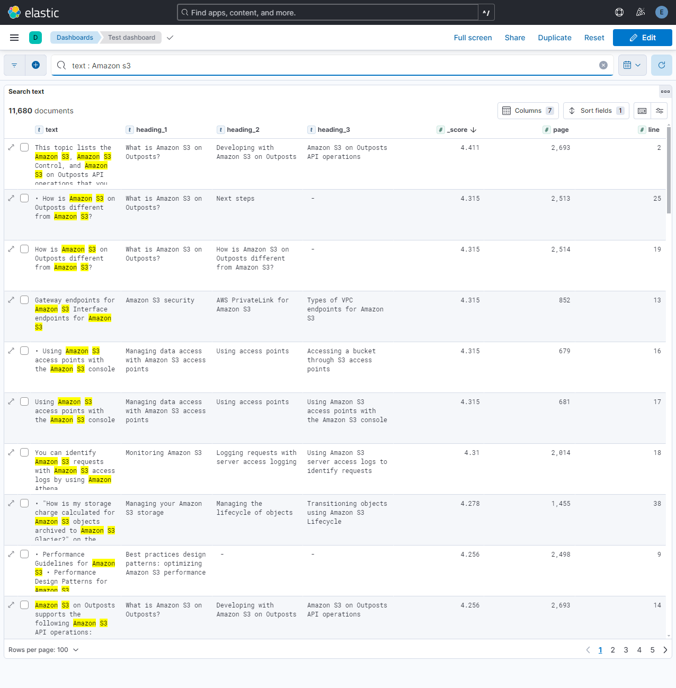

# Insert a pdf to Elastic Search

## Setup

### Setup Elasticsearch and Kibana
The necessary components are defined in `docker/docker-compose.yml`.

Change directory to `docker` and run `docker compose up` to start Elastic search and Kibana containers.
```
cd docker
docker compose up
```
After the containers are running, you access `Kibana` at `localhost:5601` and sign in with credentials of `elastic/$ELASTIC_PASSWORD`. The `$ELASTIC_PASSWORD` can be found in `docker/.env`.

To remove all the containers, run `docker compose down -v`.

## Insert data to Elastic search
Install required libraries
```
pip install -r requirements.txt
```

Use custom CLI written in `pdf2elastic_cli.py` to insert data to Elastic search.
```
cd pdf2elastic
python pdf2elastic_cli.py insert-to-elastic $pdf_file_path $index_name $batch_size
```

The script handles couple of tasks
- Extract text from the pdf file and split into paragraphs.
- Enrich paragraph with metadata (headings, page, line).
- Insert to ElasticSearch by batch.

Output of the script:


## Search a keyword

### Using CLI
Use custom CLI written in `pdf2elastic_cli.py` to search for a keyword.
```
cd pdf2elastic
python pdf2elastic_cli.py search $keyword $index_name $size
```


### Kibana devtool
Use Dev tool in Kibana to query data.


### Kibana dashboard
You can explore data and build dashboard in Kibana. An example of a dashboard showing relevant documents of a keyword is presented below.

